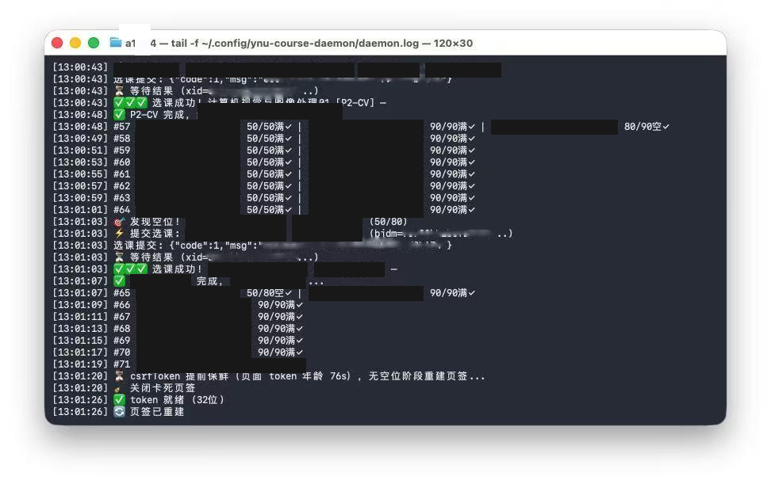

# YNU Course Raider

> 云南大学研究生选课系统自动抢课守护脚本 —— 在名额放出的瞬间，帮你把课抢到手。

Field-proven: successfully grabbed **two target courses** during the 2026-08-27 and 2026-08-29 quota expansions (from detecting the vacancy to the selection confirmed, all within **1 second**).



*Above: live capture of the daemon's terminal log — vacancy detected → submit (code=1) → selection confirmed → group done, all within the same second.*

## 项目简介

这是一个运行在 [Ego Browser](https://github.com/citrolabs/ego-lite)（Chromium 内核）页面上下文中的 Node.js 守护脚本。它持续监控目标课程的名额变化，发现空位立即提交选课，全程无人值守：

- **持续监控**：1.5s 轮询课程查询接口，全量查询、不污染搜索框
- **零延迟提交**：token 保鲜前置 + 提交前二次检查 + 通知后置，发现空位的同一秒内完成提交
- **自动重登录**：会话过期后自动走「取验证码 → OCR 识别 → 提交登录」闭环，云端三模型候选合并
- **故障自愈**：Ego 渲染进程卡死自动重建页签、CSRF token 过期自动保鲜
- **结果通知**：抢课成功/失败 macOS 桌面通知 + 蜂鸣

## 使用指南

### 环境要求

- macOS（通知依赖 `osascript`）
- [Ego Browser](https://github.com/citrolabs/ego-lite)（`ego-browser` CLI 在 `~/.local/bin`）
- Node.js（脚本本身零依赖，仅用标准库）
- 可选：DashScope API key（云端验证码识别）或本地 [Ollama](https://ollama.com)（qwen3-vl:4b 兜底）

### 安装与配置

```bash
# 1. 下载脚本
git clone https://github.com/sakuramg/ynu-course-raider.git
cd ynu-course-raider

# 2. 配置登录凭证（学号 + 密码 + 可选 DashScope API key）
mkdir -p ~/.config/ynu-course-raider
cat > ~/.config/ynu-course-raider/credentials.json <<'EOF'
{
  "loginName": "你的学号",
  "loginPwd": "你的密码",
  "apiKey": "sk-你的DashScope密钥（可选）"
}
EOF
chmod 600 ~/.config/ynu-course-raider/credentials.json

# 3. 修改脚本顶部的 CONFIG.groups，填入你要抢的课程
#    （课程代码可在选课系统「开课课程查询」中查看，KCDM 字段）
```

### 运行

```bash
# 启动守护（后台）
cat ynu-course-raider.js | ego-browser nodejs

# 查看日志
tail -f ~/.config/ynu-course-raider/daemon.log
```

脚本会在 Ego Browser 中自动打开选课页面并开始监控。抢课成功会弹出桌面通知；三门全部抢到后脚本自动停止。

### 配置项速查

| 配置 | 说明 | 默认 |
|---|---|---|
| `CONFIG.groups` | 目标课程组（`codes`=课程代码，`classFilter`=班级过滤） | 示例三组 |
| `CONFIG.pollInterval` | 轮询间隔（秒） | 1.5 |
| `CONFIG.cloudVlmEnabled` | 云端验证码识别开关 | true |
| `CONFIG.cloudVlmModel*` | 云端模型（DashScope OpenAI 兼容） | qwen3.8-max / 27b / omni-plus |
| `CONFIG.vlmEnabled` | 本地 Ollama 兜底开关 | true |
| `CONFIG.credentialsPath` | 凭证文件路径 | `~/.config/ynu-course-raider/credentials.json` |

## 这一路踩过的坑（前人栽树，后人乘凉）

这些坑是两轮真实抢课 + 四轮独立代码审查换来的，每一条都有实测证据。

### 1. CSRF token 独立过期 —— 抢课提交失败的头号杀手

- 选课系统的**查询接口不需要 CSRF token，但提交接口必须带**，且 token 随页面加载时间过期（**实测 TTL 波动：100~230 秒**，不同会话/网络下不同）。
- 后果：脚本轮询一切正常（读路径 OK），但空位出现时提交报 `页面已过期` —— 你看到的"正常"全是假象。
- 解法：**token 保鲜前置**——每轮查询前检查 token 年龄，超阈值（保守设 75s）就在无空位阶段重建页签，确保空位出现时 token 必然新鲜。

### 2. 保鲜必须做在「没有空位」时，而不是「发现空位」时

- 第一次翻车：发现空位才重建页签，6~10 秒的重建延迟全部浪费在最稀缺的提交窗口上，眼睁睁看着名额被别人抢走。
- 正确做法：无空位阶段提前刷新 token，提交路径零延迟。

### 3. 验证码 OCR：本地小模型全军覆没，云端大模型才是答案

- 实测数据：本地 qwen2.5vl:3b / qwen3-vl:4b / minicpm-v / tesseract / 模板匹配全部不可靠（识别率 17%~33%）。
- 云端 qwen3.8-max 单次 83%，三模型候选合并后大幅提升。
- 两个隐蔽陷阱：
  - **OCR 专用模型对小验证码丢字符**（放大反而更糟）——通用多模态模型才是正解；
  - **无效 bjdm 探针是防探测骗局**：用无效课程代码测 token，后端不校验直接返回"容量已满"，让你误以为 token 有效——必须用真实存在的冲突课程做探针，或干脆纯时间保鲜。

### 4. Ego/Chromium 渲染进程会"假死"

- 长时间运行的页签，`Runtime.evaluate` 全部超时（连 `document.readyState` 都不响应），但系统内存正常——是渲染进程 JS 引擎挂起，不是 GC 问题。
- **刷新（gotoAndWait）是诱因不是解药**；关闭页签重开才是解药（实测 4ms 恢复）。

### 5. 系统代理崩溃 = Ego 网络全挂的"半死"症状

- 页面 HTML 能加载（9KB 框架），但内联 JS 的异步请求全部失败 → jQuery 永不加载、token 永不注入 → 表现为"会话过期 + 页面半死"，极易误判为登录问题。
- 排查：`nc -z 127.0.0.1 7890` 查代理端口；国内站点（如 YNU）直连反而更快更稳。

### 6. async 改造必须全链路审计 + 离线测试钉住

- 把 `cloudVlmCall` 改成 async 后漏改调用方，验证码候选变成 `"[object Promise]"` 字符串被当真实验证码提交，**触发了真实账号锁定**。
- 教训：改 async 必须同步审计所有调用链，且要有离线回归测试（stub 返回 "ABCD"，断言候选是真实值而非 Promise 字符串）。

## 目录结构

```
ynu-course-raider/
├── ynu-course-raider.js   # 主脚本（零依赖）
├── README.md              # 本文件
├── assets/
│   └── success-screenshot.png  # 实战效果截图
└── docs/
    └── FINDINGS.md        # 技术发现详细版（含实验数据）
```

## 免责声明

本项目仅供学习研究。抢课请遵守学校教务规定；脚本可能因系统改版失效，作者不对任何后果负责。**请勿用于破坏性用途。**

## License

MIT
